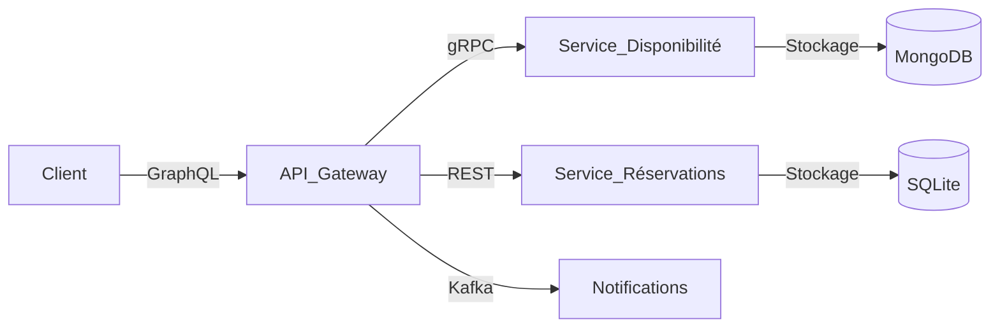
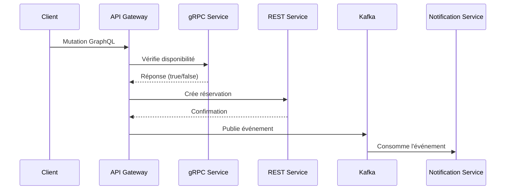

# 🏨 Système de Réservation en Microservices
## 🌟 Aperçu
**Architecture microservices complète** implémentant 4 modèles de communication différents pour une application de réservation de salles. Ce projet sert de démonstration pédagogique pour un cours sur les architectures distribuées.

## 🛠 Stack Technologique
| Composant | Technologies | Port |
|-----------|-------------|------|
| **API Gateway** | Apollo Server, Express | 4001 |
| **Réservations** | Express, REST | 3000 |
| **Disponibilité** | gRPC, Protocol Buffers | 50051 |
| **Notifications** | KafkaJS, Event-Driven Architecture | 9092 |
## 🚀 Guide d'Installation
### **Prérequis**
* Node.js v18+
* Java 11+ (pour Kafka)
* Kafka 3.9.0
### **🛠 Configuration Initiale**
```bash
# 1. Cloner le dépôt
git clone https://github.com/aziztrad/reservation-microservices.git
cd reservation-microservices
# 2. Installer les dépendances
npm run setup  # Exécute 'npm install' dans tous les services
```
### **▶ Démarrer l'Environnement**
```bash
# Dans des terminaux séparés (ordre important)
npm run start-zookeeper  # bin/windows/zookeeper-server-start.bat ...
npm run start-kafka      # bin/windows/kafka-server-start.bat ...
npm run start-grpc       # cd availability-service && node server.js
npm run start-rest       # cd reservations-service && node index.js
npm run start-kafka-consumer # cd notifications-service && node index.js
npm run start-gateway    # cd api-gateway && node index.js
```
## 🔍 Points d'Accès
| Service | URL | Description |
|---------|-----|-------------|
| **GraphQL** | http://localhost:4001/graphql | Point d'entrée principal |
| **Playground** | http://localhost:4001/graphql | Interface GraphQL interactive |
| **Health Check** | http://localhost:4001/health | Vérification de l'état du système |
## 💡 Exemples d'Utilisation
### **Mutation GraphQL**
```graphql
mutation CreateReservation {
  createReservation(room: "202", user: "Pierre") {
    id
    room
    user
    status
  }
}
```
*Exemple de réponse réussie :*
```json
{
  "data": {
    "createReservation": {
      "id": "3",
      "room": "202",
      "user": "Pierre",
      "status": "CONFIRMED"
    }
  }
}
```
### **Requête GraphQL**
```graphql
query GetReservations {
  reservations {
    id
    room
    user
    createdAt
  }
}
```
## 📊 Architecture Détaillée
### **Workflow de Réservation**


## 💾 Stockage des Données
Les données seront stockées dans :
* `reservations-service/db.js` (SQLite)
* `availability-service/db.js` (LowDB)

## 👥 Auteurs
* @aziztrad
